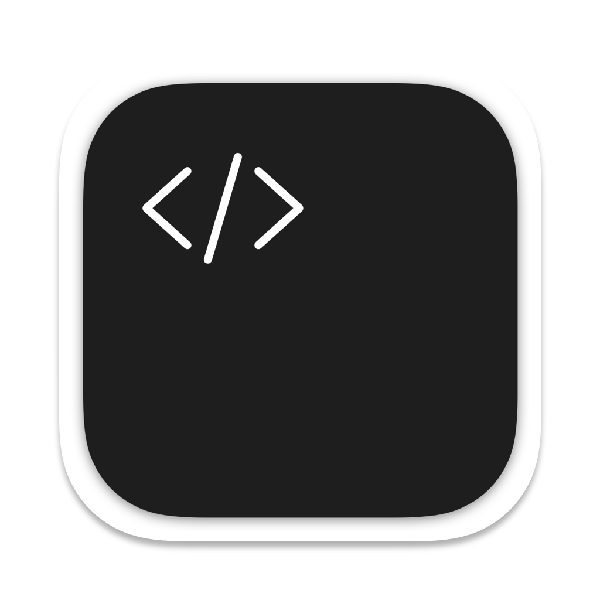

  
  <h1 align="center">Tricks iOS and macOS client</h1>

| :warning: | **This project is currently in development and we do not yet offer a download.**   We will post a link here when we have an alpha release ready for testing. Until then, we welcome contributors to help bring this project to life. |
| - |:-|

### Configure the project 🛠

- Clone the project
- Open __`Config.xconfig`__ file with any editor except **xcode** and change __`TRICKS_APP_ID`__'s value to your **new app bundle identifier**.
- Open the __`Tricks.xcodeproj`__ file with xcode, open the project's file and go to __`Signing & Capabilities`__ and change the __`team`__.
- Build & run.

### License 📝

Licensed under the [GNU GENERAL PUBLIC LICENSE Version 3](https://github.com/Aseman-Land/Tricks-Swift/blob/main/LICENSE.md).
